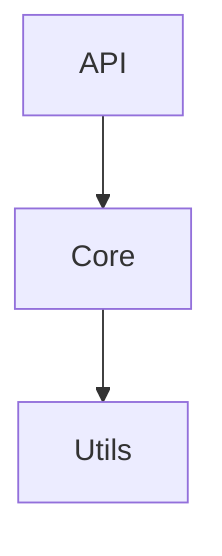

# DocMind

基于 LLM 的 Python 项目文档生成工具，支持完全离线使用。

## 特性

- **双重文档输出**：同时生成用户文档和开发者文档
- **完全离线**：支持 vLLM 本地推理服务，无需联网
- **函数/类级分析**：深度提取代码结构和 API 信息
- **自动生成图表**：自动生成 Mermaid 架构图、类图、时序图
- **自定义需求**：通过 Markdown 文件定义文档格式和内容要求
- **多语言支持**：可配置输出语言（中文、英文等）
- **纯 Python 实现**：易于安装和使用

## 安装

### 从 PyPI 安装（推荐）

```bash
pip install docmind
```

### 从源码安装

```bash
git clone https://github.com/yourname/docmind.git
cd docmind
pip install -e .
```

### 可选依赖

如果你有 NVIDIA GPU 并希望使用 CUDA 加速：

```bash
pip install docmind[cuda]
```

## 快速开始

### 1. 启动 vLLM 服务

```bash
# 安装 vLLM
pip install vllm

# 启动服务（使用 Qwen 模型示例）
vllm serve Qwen/Qwen2.5-72B-Instruct --api-key EMPTY
```

### 2. 初始化配置

```bash
# 在项目目录下创建配置文件
cd /path/to/your/project
docmind init
```

这将创建两个文件：
- `docmind.yaml` - 主配置文件
- `docmind-requirements.md` - 自定义需求模板（可选）

### 3. 生成文档

```bash
# 基本用法
docmind generate /path/to/your/project

# 指定配置文件
docmind generate /path/to/your/project --config ./docmind.yaml

# 仅生成用户文档
docmind generate /path/to/your/project --only user

# 仅生成开发者文档
docmind generate /path/to/your/project --only dev
```

### 4. 查看结果

生成的文档将保存在 `<project>/docs/` 目录下：
- `user-guide.md` - 用户文档
- `dev-guide.md` - 开发者文档
- `README.md` - 索引页

## 配置说明

### docmind.yaml

```yaml
# 项目信息（可选，自动从 pyproject.toml 提取）
project:
  name: ""
  version: ""
  description: ""
  author: ""

# 自定义需求文件
custom_requirements:
  file: "docmind-requirements.md"
  apply_to:
    user_guide: true
    dev_guide: true

# 输出配置
output:
  user_guide: "user-guide.md"
  dev_guide: "dev-guide.md"
  language: "zh-CN"  # zh-CN, en-US 等

# LLM 配置（vLLM OpenAI 兼容模式）
llm:
  base_url: "http://localhost:8000/v1"
  model: "Qwen/Qwen2.5-72B-Instruct"
  api_key: "EMPTY"
  temperature: 0.7
  max_tokens: 4096

# 嵌入模型配置
# provider: "local" 使用本地模型（完全离线）
# provider: "openai" 使用 OpenAI 或兼容 API
embedder:
  provider: "local"           # "local" 或 "openai"
  model: "BAAI/bge-m3"        # 模型名称
  device: "cuda"              # 本地模式: cuda, cpu, auto
  batch_size: 32
  # api_key: "sk-xxx"         # openai 模式需要
  # base_url: ""              # openai 模式可选
  # dimensions: null          # openai 模式: 输出维度

# 检索配置
retriever:
  top_k: 15  # 每次检索返回的代码块数量

# 文档生成配置
generator:
  user_guide:
    include_installation: true
    include_quickstart: true
    include_examples: true
  dev_guide:
    include_architecture: true
    include_api: true
    include_contributing: true
  mermaid:
    enabled: true
    max_diagrams: 5
```

### 自定义需求文件

通过 `docmind-requirements.md` 文件，你可以精确控制文档的生成格式：

```markdown
# 文档自定义需求

## 通用要求

- 所有代码示例使用 Python 3.10+ 的类型注解语法
- 每个函数说明必须包含"参数"、"返回值"、"异常"三个小节

## 用户文档要求

### 类说明格式

对于每个主要类，请按以下格式说明：

- 类名
- 用途：一句话描述
- 主要方法列表
- 使用示例

## 开发文档要求

### API 文档格式

对于每个公开 API：
- 函数签名
- 参数说明
- 返回值说明
- 使用示例
```

## CLI 命令

### `docmind init`

初始化配置文件。

```bash
docmind init                    # 在当前目录创建配置文件
docmind init --output ./config  # 指定输出目录
```

### `docmind generate`

生成文档。

```bash
docmind generate /path/to/project                    # 基本用法
docmind generate /path/to/project --config conf.yaml # 指定配置文件
docmind generate /path/to/project --output ./docs    # 指定输出目录
docmind generate /path/to/project --only user        # 仅生成用户文档
docmind generate /path/to/project --requirements req.md  # 指定需求文件
docmind generate /path/to/project --verbose          # 详细输出
```

### `docmind --version`

显示版本号。

## 输出示例

### 用户文档结构

```markdown
# 项目名称 用户文档

> 文档生成时间: 2026-03-16 10:00:00
> 本文档由 DocMind 自动生成

## 项目简介

...

## 安装指南

...

## 快速开始

...

## 功能模块

### 模块 A

...

## 配置说明

...
```

### 开发者文档结构

```markdown
# 项目名称 开发者文档

> 文档生成时间: 2026-03-16 10:00:00
> 本文档由 DocMind 自动生成

## 项目架构



...

## 核心模块详解

...

## API参考

### class SomeClass

...

## 开发指南

...
```

## 支持的嵌入模型

DocMind 支持两种嵌入模型方式：

### 本地模型（provider: "local"）

推荐使用以下本地嵌入模型（完全离线）：

| 模型 | 维度 | 特点 |
|------|------|------|
| BAAI/bge-m3 | 1024 | 中英文效果好，多语言支持（推荐） |
| BAAI/bge-small-zh | 512 | 轻量，中文效果好 |
| sentence-transformers/all-MiniLM-L6-v2 | 384 | 极轻量，英文 |

首次运行时会自动下载模型，之后可完全离线使用。

### 云服务 API（provider: "openai"）

支持 OpenAI 及其他兼容 OpenAI embedding API 的服务：

```yaml
embedder:
  provider: "openai"
  model: "text-embedding-3-small"  # 或 text-embedding-3-large
  api_key: "sk-your-api-key"
  # base_url: "https://api.openai.com/v1"  # 可选，自定义端点
  dimensions: 512  # 可选，指定输出维度
```

## 支持的 LLM

DocMind 通过 OpenAI 兼容 API 与 LLM 交互，支持：

- **vLLM**：本地部署，推荐
- **Ollama**：本地部署
- **OpenAI**：云端 API
- 其他兼容 OpenAI API 的服务

## 开发

### 运行测试

```bash
pip install -e ".[dev]"
pytest
```

### 代码风格

```bash
ruff check .
ruff format .
```

## 许可证

MIT License

## 致谢

本项目受到 [deepwiki-open](https://github.com/AsyncFuncAI/deepwiki-open) 的启发。